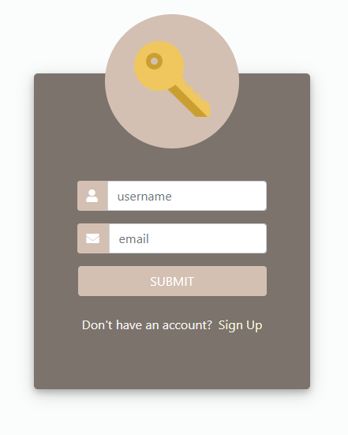
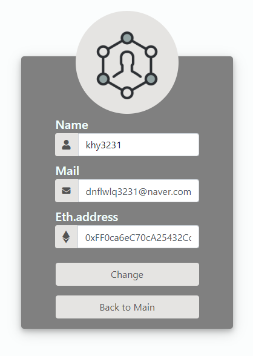

# [Start GameCentre](http://203.236.220.47:3000/)

[GameCentre](http://203.236.220.47:3000/) 는 블록체인 이더리움(Ethereum) 스마트 컨트렉트들로 제작된 게임들을 모아 놓았습니다. 
 총 4가지의 게임이 준비되어 있습니다. 자세한 내용은 아래에 설명하겠습니다.

## Preview

**[View Live Preview](http://203.236.220.47:3000/)**

- `LOGIN` : 로그인 페이지로 이동합니다
- `GAMELIST` : 메인 페이지 내의 게임목록 창으로 이동합니다
- `ABOUT` : 메인 페이지 내의 소개 창으로 이동합니다
- `CONTACT` : 메인 페이지 내의 연락 창으로 이동합니다
- `PROFILE` : 내 정보 페이지로 이동합니다 (로그인 시에만 이용 가능)

## Status

## Usage

### Login

[]

- 본 페이지는 로그인을 해야만 모든 기능을 이용할 수 있습니다. 로그인은 메인페이지의 `LOGIN` 버튼을 눌러 로그인페이지로 접속 후 진행합니다. 
- 아이디와 패스워드를 데이터베이스에서 확인 후 맞다면 로그인이 되며 메인페이지로 이동합니다
- 만약 계정이 기억이 안나신다면 `Forgot your password?` 버튼을 눌러 비밀번호를 찾을 수 있습니다
- 만약 계정이 없다면 `Sign up` 버튼을 눌러 계정을 생성할 수 있습니다  

### Sign up

[]

- `Username` : 사용할 아이디를 입력합니다 (수정할 수 없습니다)
- `Password` : 사용할 비밀번호를 입력합니다
- `Email` : 본인의 이메일을 입력합니다 (비밀번호를 찾을 때 입력된 메일로 알려드립니다)
- `Ethereum Account` : 본인의 지갑주소를 입력합니다. 게임진행 시 필요합니다.

### Forgot

[]

- `username` : 가입할 때 입력한 아이디를 입력하세요
- `email` : 가입할 때 입력한 이메일을 입력하세요. 비밀번호를 알려드립니다.
- `Sign Up` : 계정이 없으시다면 이 버튼을 눌러 계정을 생성하세요

반드시 가입시 작성하였던 이메일로만 비밀번호가 발송되는 점 유의하세요

### Profile

[]

- `Name` : 가입시 입력한 아이디가 보입니다 (수정이 `불가`합니다)
- `Mail` : 가입시 입력한 이메일이 보입니다 (수정이 `가능`합니다)
- `Eth.address` : 가입시 입력한 지갑 주소가 보입니다 (수정이 `가능`합니다)

## Bugs and Issues

페이지를 사용하는 데 버그나 문제점이 있나요? [Open a new issue](https://github.com/dnflwlq3231/Crypto-Gamecentre/issues) 이곳에서 `GameCentre`에 대한 의견을 남기고 이슈를 볼 수 있습니다 

