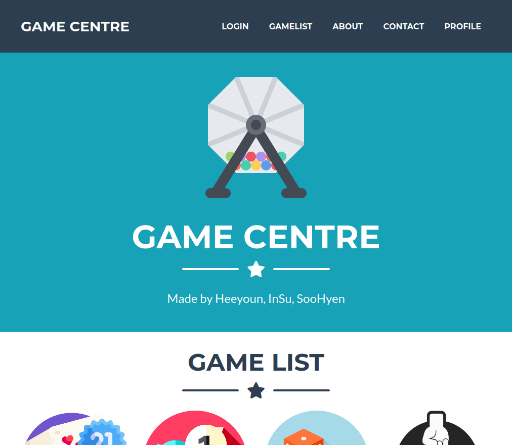
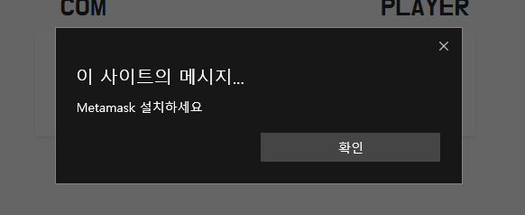
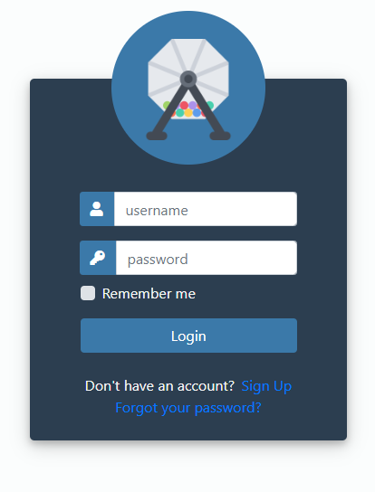
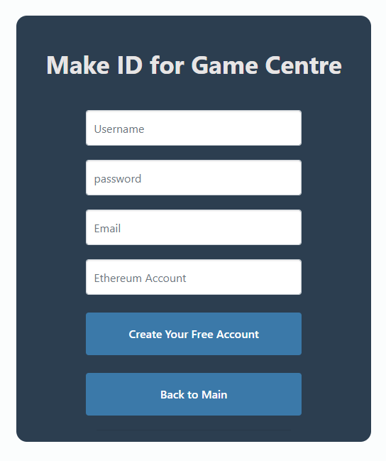
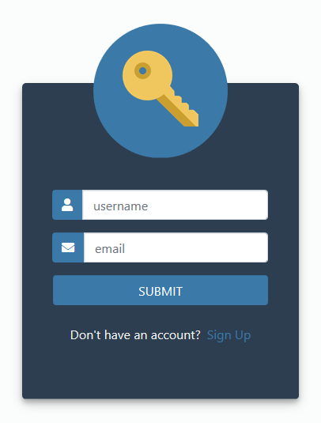
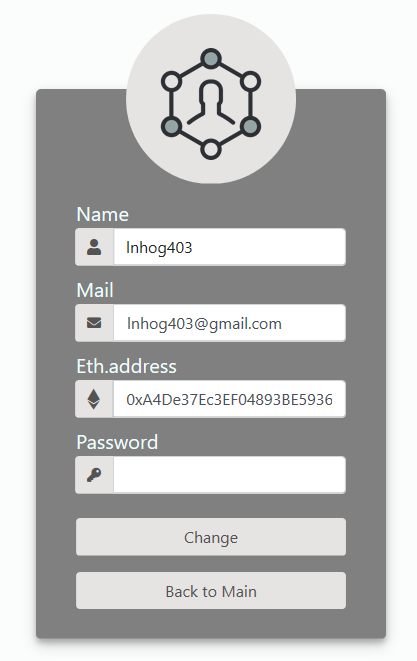
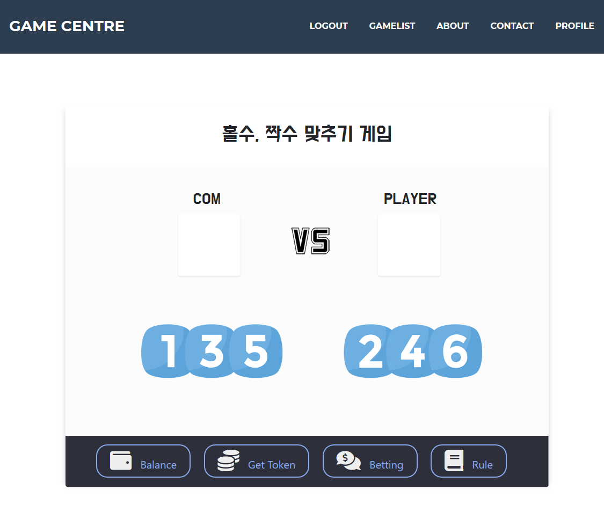
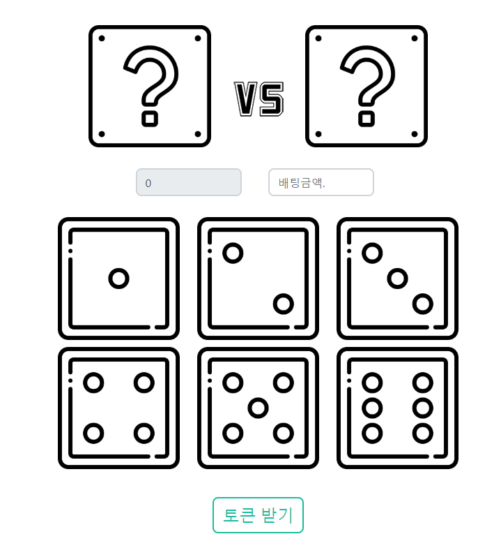
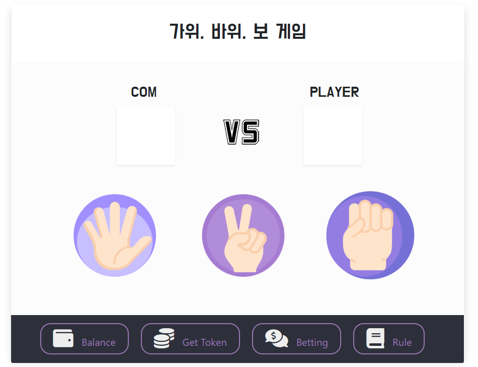
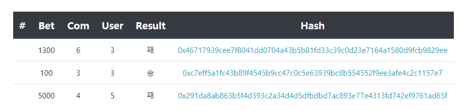

# [Start GameCentre](http://222.122.203.222:3000/)

[GameCentre](http://222.122.203.222:3000/) 는 블록체인 이더리움(Ethereum) 스마트 컨트렉트들로 제작된 게임들을 모아 놓았습니다. 
 총 4가지의 게임이 준비되어 있습니다. 자세한 내용은 아래에 설명하겠습니다.

## Preview

**[View Live Preview](http://222.122.203.222:3000/)**

- `LOGIN` : 로그인 페이지로 이동합니다.
- `GAMELIST` : 메인 페이지 내의 게임목록 창으로 이동합니다.
- `ABOUT` : 메인 페이지 내의 소개 창으로 이동합니다.
- `CONTACT` : 메인 페이지 내의 연락 창으로 이동합니다.
- `PROFILE` : 내 정보 페이지로 이동합니다. (로그인 시에만 이용 가능)

## Status

## Usage

### Requirement

게임을 진행하기에 앞서 회원가입을 하셔야 합니다. 회원으로 가입하시기 위해서는 ID, 비밀번호, Ethereuem 지갑 주소와  Ropsten Ethereum(저희의 테스트 서비스는 Ropsten test network로 구현되어있습니다)이 필요합니다.

또한 게임을 진행하기 위해서는 [MetaMask](https://metamask.io/)가 필요합니다.
먼저 MetaMask를 설치합니다. 이후 MetaMask의 지시에 따라 Ethereum 지갑을 만듭니다.
이후 `network`를 **Ropsten**으로 바꾸신 이후 `입금`을 누른 다음 아래에 `이더 얻기`를 통해 테스트용 Ethereum을 얻으실 수 있습니다.

### Login

- 본 페이지는 로그인을 해야만 모든 기능을 이용할 수 있습니다. 로그인은 메인페이지의 `LOGIN` 버튼을 눌러 로그인페이지로 접속 후 진행합니다. 
- 아이디와 패스워드를 데이터베이스에서 확인 후 맞다면 로그인이 되며 메인페이지로 이동합니다.
- 만약 계정이 기억이 안나신다면 `Forgot your password?` 버튼을 눌러 비밀번호를 찾을 수 있습니다.
- 만약 계정이 없다면 `Sign up` 버튼을 눌러 계정을 생성할 수 있습니다.

### Sign up

- `Username` : 사용할 아이디를 입력합니다. (수정할 수 없습니다)
- `Password` : 사용할 비밀번호를 입력합니다.
- `Email` : 본인의 이메일을 입력합니다. (비밀번호를 찾을 때 입력된 메일로 알려드립니다)
- `Ethereum Account` : 본인의 지갑주소를 입력합니다. 게임진행 시 필요합니다.

### Forgot

- `username` : 가입할 때 입력한 아이디를 입력하세요.
- `email` : 가입할 때 입력한 이메일을 입력하세요. 비밀번호를 알려드립니다.
- `Sign Up` : 계정이 없으시다면 이 버튼을 눌러 계정을 생성하세요.

반드시 **가입시 작성하였던 이메일로만 비밀번호가 발송되는 점** 유의하세요.

### Profile

- `Name` : 가입시 입력한 아이디가 보입니다. (수정이 **불가**합니다)
- `Mail` : 가입시 입력한 이메일이 보입니다. (수정이 `가능`합니다)
- `Eth.address` : 가입시 입력한 지갑 주소가 보입니다. (수정이 `가능`합니다)
- `Password` : 수정을 하실 때는 변경된 내용과 암호를 입력한 후에 `Change`를 누르세요.

### OddEven

이 게임은 플레이어가 홀수와 짝수중 한가지를 선택하여 고른 후 컨트랙트 상의 게임을 실행하여 
같은 결과가 나오면 보상을 받는 게임입니다.

- `COM` : 플레이어의 상대방인 컴퓨터의 결과가 나타납니다.
- `PLAYER` : 플레이어가 선택한 값이 나타납니다.

- `135` : 플레이어가 배팅액을 입력한 다음 홀수를 선택하여 게임을 진행합니다. **게임을 진행하기 위해 ETH가 수수료로 지불됩니다.**
- `246` : 플레이어가 배팅액을 입력한 다음 짝수를 선택하여 게임을 진행합니다. **게임을 진행하기 위해 ETH가 수수료로 지불됩니다.**

- `Balance` : 자신의 잔고가 표시되는 팝업이 나오게 됩니다.
- `Get Token` : 게임을 진행하기 위한 토큰이 부족한 경우 1000개의 토큰을 받을 수 있습니다. **수수료로 ETH가 소모됩니다.**
- `Betting` : 게임을 플레이하기 위해서 배팅을 합니다. 플레이어는 자신이 원하는 만큼의 토큰을 배팅할 수 있습니다.
- `Role` : 게임의 룰을 알려주는 팝업이 나옵니다.

### Dice

이 게임은 플레이어가 주사위들 중 한가지를 선택하여 게임을 진행하여 같은 주사위가 나오면 보상을 받는 게임입니다.

- `물음표 상자` : 왼쪽 물음표 상자에는 컴퓨터의 결과가 오른쪽 물음표 상자에는 플레이어가 선택한 주사위가 표시됩니다.
- `회색 표시창` : 플레이어의 잔고가 표시됩니다.
- `배팅금액` : 게임을 플레이하기 위해서 배팅을 해야합니다. 플레이어는 자신이 원하는 만큼의 토큰을 배팅할 수 있습니다.
- `주사위들` : 배팅액을 입력한 플레이어가 주사위들 중 한가지를 선택할 경우 선택한 주사위로 게임을 진행하게 됩니다. **게임을 진행하기 위해 ETH가 수수료로 지불됩니다.**
- `토큰 받기` : 게임을 진행하기 위한 토큰이 부족한 경우 1000개의 토큰을 받을 수 있습니다. **수수료로 ETH가 소모됩니다.**

### Rock-Paper-Scissors

이 게임은 플레이어가 가위, 바위, 보 중 한가지를 선택하여 게임을 진행합니다. 게임을 규칙은 일반적인 가위, 바위, 보 게임과 동일하며 플레이어가 이긴 경우에는 보상을 받을 수 있습니다.

- `COM` : 플레이어의 상대방인 컴퓨터의 결과가 나타납니다.
- `PLAYER` : 플레이어가 선택한 값이 나타납니다.

- `가위, 바위, 보`: 플레이어가 배팅액을 적은 다음 보, 가위, 바위 중 한가지를 선택하면 게임이 진행됩니다. **게임을 진행하기 위해 ETH가 수수료로 지불됩니다.**

- `Balance` : 자신의 잔고가 표시되는 팝업이 나오게 됩니다.
- `Get Token` : 게임을 진행하기 위한 토큰이 부족한 경우 1000개의 토큰을 받을 수 있습니다. **수수료로 ETH가 소모됩니다.**
- `Betting` : 게임을 플레이하기 위해서 배팅을 합니다. 플레이어는 자신이 원하는 만큼의 토큰을 배팅할 수 있습니다.
- `Role` : 게임의 룰을 알려주는 팝업이 나옵니다.

### Record

게임 페이지의 아래에는 위와 같이 최근 5 게임의 결과를 표시해줍니다.
`Hash`의 링크를 통해 [Etherscan](https://etherscan.io)으로 이동하여 게임에 관한 정보를 확인하실 수 있습니다.

## Bugs and Issues

페이지를 사용하는 데 버그나 문제점이 있나요? [Open a new issue](https://github.com/dnflwlq3231/Crypto-Gamecentre/issues) 이곳에서 `GameCentre`에 대한 의견을 남기고 이슈를 볼 수 있습니다.

